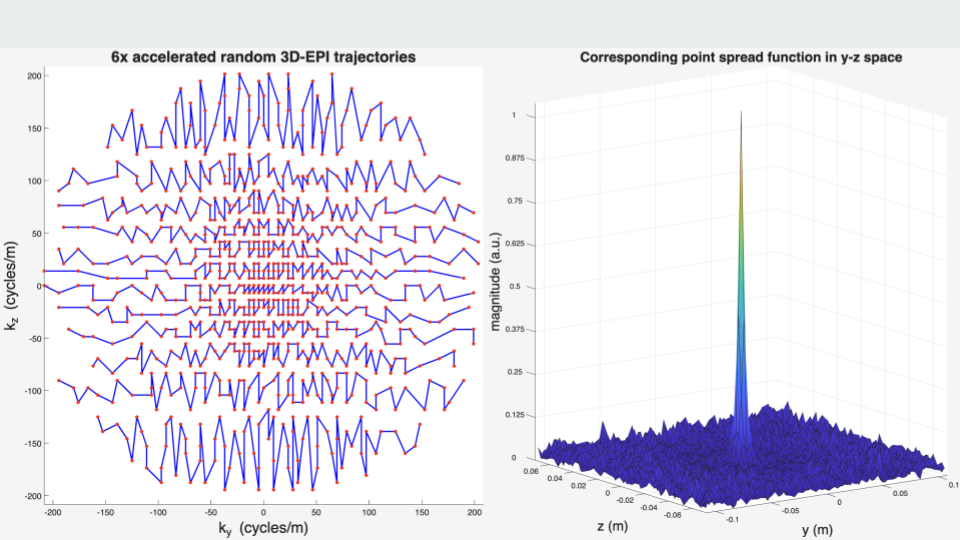

# ArbEPI: matlab/pulseq code for generating 3D-EPI sequences from arbitrary 2D sampling masks in the phase-encode-partition (ky-kz) plane


## Background
According to compressed sensing, randomly sampling k-space results in incoherent interference in some sparse transform domain e.g. wavelets. This effectively turns the dealiasing problem into a denoising problem, thus allowing the image the be reconstructed from sub-Nyquist sampled k-space. The same principles can be extended to dynamic MRI, where the desired image, when reshaped into a (space x time) matrix, is low-rank in applications like fMRI. By definition, a low-rank matrix is sparse in the singular value domain, thus we want aliasing artifacts that are dense in the singular value domain i.e. high-rank or noise-like when reshaped into a (space x time) matrix. This can be achieved by randomly sampling k-t-space, but there are two obstacles: 1. It is unclear what is the best random sampling strategy. 2. It is technically nontrivial to program the MRI scanner randomly sample k-space. To address these challenges, we present ArbEPI, a framework that accepts arbitrary 2D sampling masks in the phase-encoding-partition (ky-kz) plane and creates fast vendor-agnostic 3D-EPI sequences using the open-source Pulseq library. Examples include: CAIPI, temporally-interleaved CAIPI (TI-CAIPI), Poisson-disc, Gaussian random, uniform random, golden-angle radial, and jittered-grid sampling. Tested on GE scanners.

## Getting started
1. Set experimental parameters in `params.m`. The sampling method (`samplingMethod`) and GE hardware constants are also configured here. Make a copy of this file for each experiment to preserve parameters for reconstruction.
2. Run `main.m` to generate all four sequences at once:
    ```matlab
    main
    ```
    Or run individual sequences manually in order:
    ```matlab
    omegas = gen_sampling_masks(R);   % Ny x Nz x Nframes logical mask
    ArbEPI(omegas);  % writes ArbEPI.seq/.pge and samp_locs.mat
    EPIcal();        % writes EPIcal.seq/.pge and kxoe<Nx>.mat
    GRE();           % writes GRE.seq/.pge (optional)
    noise();         % writes noise.seq/.pge (optional)
    ```
    All outputs go to `output/`. `EPIcal` and `noise` must run after `ArbEPI` as they load `samp_locs.mat`.

## On the scanner (GE)
1. Set up `.pge` files by following: https://github.com/jfnielsen/TOPPEpsdSourceCode/tree/UserGuide/v7#running-a-sequence-on-the-scanner (private repo).
2. Run a localizer sequence.
3. Run `EPIcal.pge` using auto-prescan.
4. Run `noise.pge` using manual-prescan, keeping the same receiver gain settings from the previous step.
5. Run `ArbEPI.pge` using manual-prescan, keeping the same receiver gain settings from the previous step.
6. (optional) Run `GRE.pge` using auto-prescan.

## File overview

**Root — user-facing files**

| File | Purpose |
|------|---------|
| `params.m` | Central configuration: scan geometry, timing, GE hardware constants, sampling method, output directory |
| `main.m` | Run all four sequences in order from a single entry point |
| `gen_sampling_masks.m` | Generate `Ny × Nz × Nframes` sampling mask given acceleration factor `R` |
| `ArbEPI.m` | Main 3D-EPI sequence function; takes sampling mask as input |
| `EPIcal.m` | Calibration sequence (mirrors ArbEPI, blips zeroed) |
| `GRE.m` | Gradient echo reference sequence for sensitivity maps |
| `noise.m` | Noise prescan for noise prewhitening |
| `plot_epi.m` | Visualization scripts (trajectories, sampling mask, PSF) |

**`lib/` — helper functions (called by the scripts above)**

| File | Purpose |
|------|---------|
| `mask2epi.m` | Core algorithm: partition 2D mask into efficient EPI trajectories |
| `caipi_sample.m` | Regular CAIPI-shifted sampling masks |
| `ticaipi_sample.m` | Temporally-interleaved CAIPI masks (golden-angle frame rotation) |
| `pd_sample.m` | Variable-density Poisson-disc sampling masks [1] |
| `rand_sample.m` | Weighted random sampling masks |
| `radial_sample.m` | Golden-angle stack-of-stars Cartesian approximation masks |
| `jitter_sample.m` | Jittered-grid sampling masks |
| `gen_gaussian_pdf.m` | 2D Gaussian probability density for use with `rand_sample` |
| `make_calib_mask.m` | Fully-sampled calibration region for use with `radial_sample` |
| `make_fatsat_rf.m` | Create fat-saturation RF pulse object |
| `make_excitation_pulse.m` | Create slab-selective sinc excitation pulse |
| `make_readout_grads.m` | Create EPI readout gradients, blips, and ADC event |
| `make_prephasers.m` | Create x/y/z prephaser trapezoids |
| `make_spoilers.m` | Create x/y/z spoiler trapezoids |
| `calc_te_tr_delays.m` | Compute TE and TR padding delays |
| `plot_kt_mask.m` | Interactive viewer for k-t sampling mask `(ky, kz, time)`; scroll wheel, slider, or arrow keys to scrub through frames |
| `write_to_ge.m` | Convert Pulseq sequence to GE TOPPE format and write `.pge` |
| `rf2pulseq.m` | Convert RF waveform from Gauss to Hz |
| `check_grad_acoustics.m` | Check gradient waveforms for forbidden frequencies |

**`output/`** — generated `.seq`, `.pge`, and `.mat` files (gitignored)

## Methods overview
1. The core logic is in `mask2epi()`, which accepts any 2D sampling mask of size `(Ny, Nz)` and partitions it into efficient 3D-EPI trajectories given the echo train length and number of shots.
2. Sampling mask generators:
    - `caipi_sample()` — uniformly spaced, CAIPI-shifted masks.
    - `ticaipi_sample()` — temporally-interleaved CAIPI; the CAIPI shift rotates each frame to improve temporal incoherence.
    - `pd_sample()` — variable-density Poisson-disc masks based on the SigPy implementation [1].
    - `rand_sample()` — random masks weighted by a 2D probability mass function (e.g. `gen_gaussian_pdf()`).
    - `radial_sample()` — Cartesian approximation of a stack-of-stars trajectory; spoke angles follow the golden angle across frames.
    - `jitter_sample()` — regular undersampled grid with a random integer shift each frame; global-shift mode preserves inter-sample spacing, per-cell mode adds independent per-sample jitter.
    - All methods are dispatched through `gen_sampling_masks(R)` via the `samplingMethod` parameter in `params.m`.
3. Trajectory generation details:
    - Samples near ky = 0 are distributed evenly across the echo train (center-out ordering) so that the effective echo time is approximately constant across shots.
    - ky is non-decreasing within each echo train so that B0-induced distortion along the phase-encode direction stays coherent.
4. Pulseq implementation details:
    - All ky and kz blips share the same duration and are contained within their readout block, enabling efficient representation as scaled copies of a single waveform.
    - The readout trapezoid is circularly shifted (split and sign-flipped) so that blips fall within the block boundary.
5. Unsolved problems:
    - Acquisition speed is bottlenecked by large k-space jumps between EPI lines. Constraining jump size whilst preserving sampling incoherence is an ongoing research problem.

## Notes
The "Arb" in the package name has two meanings:
1. The framework accepts arbitrary sampling masks as input.
2. The package was developed in Ann Arbor, Michigan.

## References
1. Ong, F., & Lustig, M. (2019, May). SigPy: a python package for high performance iterative reconstruction. In Proceedings of the ISMRM 27th Annual Meeting, Montreal, Quebec, Canada (Vol. 4819, No. 5).
